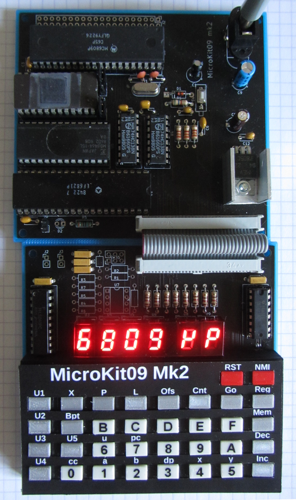

## Description

In several 1983 editions of the French computer magazine 'Led' an MC6809 
single board computer was published, supporting a 6-digit, 7-segment Led 
display and 34 keys. The original has a 2 kByte monitor ROM and 2 kByte 
RAM. 

Most published material can be found here: 
https://lab.nethence.com/frederic/Microit09/

This is a recreation, with a smaller footprint and some room for 
expansion.

The orignial, published monitor version is 1.8. This repository contains
my minor enhancements.

My webpage on the subject can be found here: 
http://electrickery.connected.by.freedominter.net/comp/microKit09/
